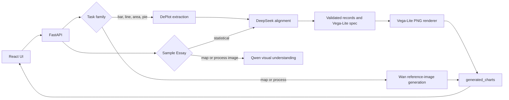

# Architecture

## Request flow



## Boundaries

- `main.py` translates HTTP requests and responses. It does not contain model
  prompts or renderer-specific logic.
- `paths.py` owns all runtime directories, so startup behavior is independent
  of the terminal's current working directory.
- `storage.py` validates filenames and usernames and centralizes persistence.
- `hybrid_feedback.py` is the only module that chooses a rendering pipeline.
- `chart_feedback.py` asks DeepSeek for one common long-form record structure.
- `chart_detection.py` performs high-confidence local pie detection for Auto
  Detect, avoiding another paid model request.
- `chart_renderer.py` validates and renders Vega-Lite specifications.
- `wan_image_renderer.py` handles reference-image generation for spatial tasks.
- `spatial_sample_essay.py` uses Qwen visual understanding to write map and
  process reports directly from the uploaded image, without DePlot.
- `api.js` is the frontend's only direct HTTP boundary.

## Unified statistical representation

All statistical chart types use records with the same fields:

```json
{
  "category": "2001",
  "series": "Local calls",
  "period": "2001",
  "region": null,
  "value": 72,
  "x": null,
  "y": null,
  "estimated": false,
  "missing": false,
  "confidence": 0.98
}
```

The source chart supplies labels, ordering, units, and expected structure. The
student's report supplies displayed values. Missing and inferred values remain
explicit, rather than being silently copied from the source.

Vega-Lite is the deterministic renderer for statistical charts. Wan is used
only where a declarative statistical chart cannot express spatial changes,
namely IELTS map and process tasks. Wan results require manual review because
generative images can alter labels or geometry.

The renderer also enforces presentation invariants after model output: nominal
domains retain source order, colors stay bound to that order, and pie charts
always receive a category-and-value text layer.

## Runtime data

These directories are created automatically and must not be committed:

- `backend/uploaded_images`: temporary source uploads
- `backend/generated_charts`: generated feedback images
- `backend/user_data`: per-user writing and image snapshots

API keys stay in `backend/.env`; the tracked `.env.example` contains names and
safe placeholders only.
